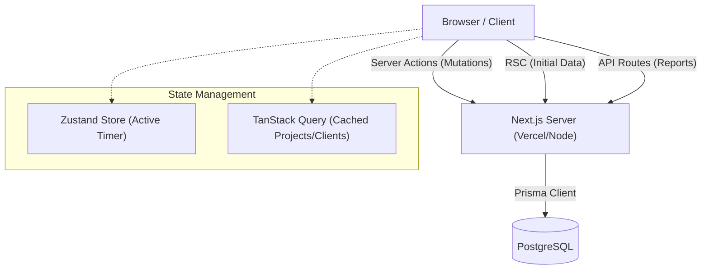

# Project Blueprint: "Retainer-Tracker" (Enterprise Time & Budget Manager)

**Version:** 1.0.0
**Date:** January 19, 2026
**Author:** Gemini Agent (on behalf of James Filios)

---

## 1. Executive Summary

### 1.1. Project Vision
To build a self-hosted, SaaS-grade time tracking application that bridges the gap between simple stopwatch apps and complex enterprise resource planning (ERP) tools. The core philosophy is **"Budget-First Tracking,"** addressing the specific need for freelancers and agencies to manage retainer-based work (e.g., prepaid 10-hour blocks) effectively.

### 1.2. Core Objectives
1.  **Eliminate Unbilled Overages:** Provide real-time visibility into project budgets so the user never unknowingly works for free past a retainer limit.
2.  **SaaS Quality, Self-Owned:** Deliver a User Interface (UI) and User Experience (UX) on par with commercial tools like Clockify or Toggl, but deployable on personal hardware (Synology NAS) or standard cloud tiers (Vercel/Render) without recurring subscription fees.
3.  **Actionable Insights:** Generate professional reports and visualizations that can be directly used for invoicing or client updates.

### 1.3. Success Criteria
*   Fully functional web application deployed locally or via cloud.
*   Sub-second latency for starting/stopping timers.
*   Real-time visual alerts when a project budget exceeds 80%, 90%, and 100%.
*   Seamless responsiveness across Desktop (primary) and Mobile Web.

---

## 2. Functional Requirements

### 2.1. Time Tracking
*   **Live Timer:** A persistent global timer accessible from anywhere in the app.
*   **Manual Entry:** Ability to log past work with start/end times or duration.
*   **Billable Toggle:** One-click status to mark entries as billable vs. non-billable.
*   **Context:** Every entry must support linking to a Project, Client, and optional Tags.
*   **Notes:** Rich text or Markdown support for describing the work done.

### 2.2. Client & Project Management
*   **Hierarchical Structure:** Client -> Projects -> Time Entries.
*   **Retainer/Budget Logic (The "Killer Feature"):**
    *   **Fixed Hours Budget:** e.g., "10 Hours".
    *   **Recurring Budget:** e.g., "10 Hours per Month" (resets automatically).
    *   **Monetary Budget:** e.g., "$1,500 budget" based on hourly rates.
*   **Alert Configuration:** User-defined thresholds (e.g., "Notify me at 8 hours used").

### 2.3. Dashboard & Visualization
*   **Budget vs. Actual:** Progress bars showing burned hours vs. total budget per active project.
*   **Timeline View:** A Gantt-chart style view of the day/week.
*   **Analytics:**
    *   Pie charts: "Time breakdown by Client".
    *   Bar charts: "Daily hours worked this week".
    *   Heatmap: GitHub-style contribution graph for work habits.

### 2.4. Reporting
*   **Filtering:** Deep filtering by Date Range, Client, Project, Tag, and Billable status.
*   **Export:** PDF generation for invoices/timesheets and CSV export for raw data.
*   **Grouping:** Ability to group report rows by Project or Date.

---

## 3. Technical Architecture

### 3.1. High-Level Stack
We will utilize the **T3 Stack** philosophy (Typescript, Tailwind, tRPC-ish patterns) but adapted for modern Next.js 15 features.

| Layer | Technology | Rationale |
| :--- | :--- | :--- |
| **Framework** | **Next.js 15 (App Router)** | Industry standard, server-side rendering (SSR) for initial load speed, excellent API route handling. |
| **Language** | **TypeScript** | Strict type safety is non-negotiable for financial/time data integrity. |
| **Database** | **PostgreSQL** | Robust, ACID-compliant relational data storage. |
| **ORM** | **Prisma** | Best-in-class developer experience, auto-generated type definitions, easy migrations. |
| **Styling** | **Tailwind CSS** | Utility-first, rapid UI development. |
| **UI Library** | **Shadcn/UI** | Accessible, copy-paste components based on Radix UI. Professional aesthetic out-of-the-box. |
| **State** | **Zustand** | Minimalist global state (for the active timer). |
| **Data Fetching** | **TanStack Query (React Query)** | Caching, background updates, and optimistic UI updates. |
| **Auth** | **Better-Auth** or **NextAuth.js** | Secure, owns-your-data authentication. |
| **Deployment** | **Docker** | Containerization ensures the app runs identically on a Synology NAS as it does on Vercel. |

### 3.2. Data Architecture (Database Schema Strategy)

We will use a relational model designed for scalability.

#### Key Models:

1.  **Workspace:** Top-level tenant. Allows you to eventually invite others or separate personal/business tracking.
2.  **Client:** The entity being billed.
    *   `currency`: String (USD, EUR, etc.)
    *   `defaultRate`: Float
3.  **Project:** The specific bucket of work.
    *   `budgetType`: Enum (HOURS, FEES)
    *   `budgetReset`: Enum (NEVER, MONTHLY)
    *   `budgetLimit`: Float (The 10-hour cap)
    *   `color`: String (Hex code for UI distinction)
4.  **TimeEntry:** The atomic unit of work.
    *   `startTime`: DateTime
    *   `endTime`: DateTime (nullable if currently running)
    *   `duration`: Int (calculated seconds, useful cache)
    *   `isBillable`: Boolean
5.  **Tag:** Many-to-many relationship with TimeEntries for flexible categorization.

### 3.3. Architecture Diagram (Conceptual)

---

## 4. Detailed Roadmap

### Phase 1: Foundation & Infrastructure (Days 1-2)
*   **Goal:** A running "Hello World" app with a database connection.
*   **Tasks:**
    1.  Initialize Next.js project.
    2.  Set up Docker Compose for local PostgreSQL + Adminer (DB UI).
    3.  Configure Prisma and apply initial schema.
    4.  Install Shadcn/UI and configure the theme (Fonts, Colors).
    5.  Implement Authentication (Github/Google provider or simple Email/Pass).

### Phase 2: Core Data Management (Days 3-4)
*   **Goal:** Ability to create the structures needed to track time.
*   **Tasks:**
    1.  **Clients Page:** CRUD (Create, Read, Update, Delete) operations.
    2.  **Projects Page:** CRUD operations.
        *   *Critical:* Implement the "Budget Settings" form section here.
    3.  **Tags Page:** Simple management.

### Phase 3: The Tracker (Days 5-7)
*   **Goal:** The main interface used 90% of the time.
*   **Tasks:**
    1.  **Timer Component:** A sophisticated input bar allowing project selection and start/stop functionality.
    2.  **Manual Mode:** Toggle to enter `9:00 AM - 10:00 AM` manually.
    3.  **Daily List:** A list of today's entries below the timer. Grouped by Project.
    4.  **Edit Capabilities:** Click an entry to adjust time or change description.

### Phase 4: Budget Intelligence (Days 8-9)
*   **Goal:** The "Smart" features.
*   **Tasks:**
    1.  **Calculation Logic:** Backend service to sum duration of all entries for a project.
    2.  **Visual Indicators:** Add progress bars to the Project List and Dashboard.
    3.  **Alerting:** Simple UI alerts (Toasts) when logging time to a project near its limit.

### Phase 5: Reporting & Visualization (Days 10-12)
*   **Goal:** Data analysis.
*   **Tasks:**
    1.  **Summary Dashboard:** The "Landing Page" with Weekly totals and Top Projects.
    2.  **Reports Page:** A complex view with Date Range Pickers and Data Tables.
    3.  **Charts:** Integrate Recharts for visual breakdowns.

### Phase 6: Polish & Deployment (Days 13-14)
*   **Goal:** Production readiness.
*   **Tasks:**
    1.  **Dockerization:** Create the production `Dockerfile`.
    2.  **Synology Guide:** Document the specific settings for NAS deployment.
    3.  **Final QA:** Test edge cases (Timezones, crossing midnight, etc.).

---

## 5. Technical Challenges & Solutions

### 5.1. Handling Timezones
*   **Problem:** Browsers are in local time, servers are in UTC. "Today" is different depending on where you are.
*   **Solution:** All data stored in DB as UTC. The frontend uses `date-fns-tz` to render times in the user's local browser timezone. Reports will query based on UTC ranges derived from the user's local "Start of Day."

### 5.2. The "Crossing Midnight" Problem
*   **Problem:** A timer starts at 11:00 PM and ends at 1:00 AM. Does this count for Today or Tomorrow?
*   **Solution:** For the MVP, the entry belongs to the "Start Date." Visualizations will simply render the block. Advanced reporting can split the entry at midnight if strict daily accounting is required later.

### 5.3. Real-time Budget Updates
*   **Problem:** Calculating "Total Hours Spent" can be heavy if done on every page load for every project.
*   **Solution:** 
    1.  **Optimized Indexing:** Ensure `projectId` and `startTime` are indexed in Postgres.
    2.  **Aggregation:** Prisma's `groupBy` and `aggregate` are highly optimized. We will calculate these on-demand initially. If performance degrades (thousands of entries), we will implement a cached "current total" field on the Project model that updates via triggers or application logic on save.

---

## 6. UI/UX Design System Guidelines

### 6.1. Color Palette
*   **Primary:** Slate/Zinc (Professional, neutral).
*   **Accents:**
    *   *Blue:* Active Timer / Billable.
    *   *Green:* Budget Healthy.
    *   *Amber:* Budget Warning (>80%).
    *   *Red:* Budget Exceeded.

### 6.2. Layouts
*   **Sidebar Navigation:** Collapsible sidebar for main modules (Tracker, Projects, Reports, Settings).
*   **Top Bar:** Global Timer status, User Profile, Dark Mode toggle.
*   **Content Area:** Card-based layout with clear hierarchy.

---

## 7. Deployment Strategy

### Option A: Synology NAS (Self-Hosted)
*   **Mechanism:** Container Manager (Docker).
*   **Stack:** 
    *   Container 1: `time-tracker-app` (Node.js/Next.js).
    *   Container 2: `postgres:15`.
*   **Networking:** Use Synology Reverse Proxy to expose the app port (e.g., 3000) to a friendly URL (e.g., `tracker.local`).

### Option B: Cloud (Vercel + Neon)
*   **Mechanism:** Git Push to Deploy.
*   **Stack:**
    *   Frontend/API: Vercel (Serverless).
    *   Database: Neon (Serverless Postgres).
*   **Pros:** Zero maintenance, accessible from anywhere without VPN/Port Forwarding.

---

## 8. Conclusion
This blueprint represents a complete path to executing the "Retainer-Tracker" vision. It prioritizes the specific business logic of budget management while maintaining a standard, maintainable codebase that allows for future growth.
