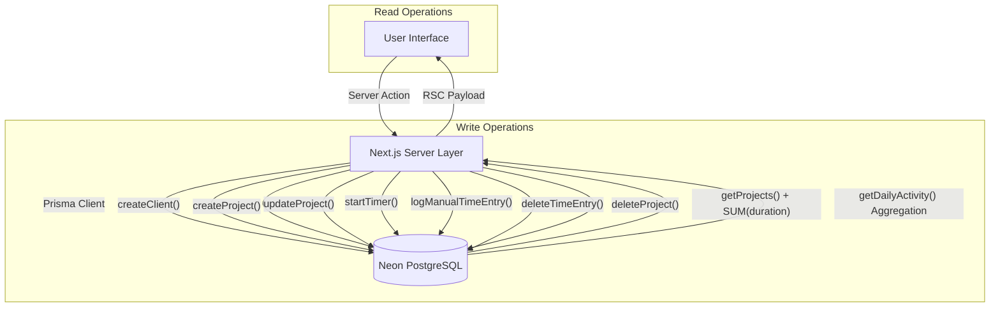
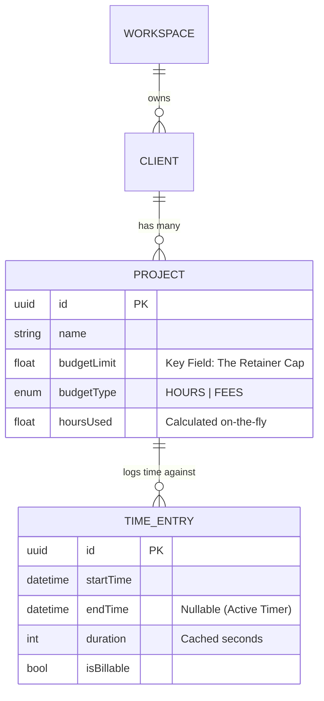

# Retainer-Tracker: Technical Architecture & Developer Guide

**Version:** 2.3.0
**Date:** January 20, 2026
**Status:** Alpha (CRUD, Tracking, Reports & Editing Implementation Complete)

---

## 1. System Overview

**Retainer-Tracker** is an Enterprise Time & Budget Management application designed for agencies and freelancers operating on a "retainer" model. Unlike standard time trackers, its primary data pivot is the **Budget Limit**.

### 1.1 Core Logic Flow
The system operates on a "Check-Act-Update" loop centered around the Database as the single source of truth.

---

## 2. Technical Architecture

### 2.1 Stack Components

| Layer | Technology | Version | Role |
| :--- | :--- | :--- | :--- |
| **Framework** | **Next.js** | 15.1.0 | Full-stack React framework (App Router). |
| **Language** | **TypeScript** | 5.x | Strict type safety across DB, API, and UI. |
| **Database** | **PostgreSQL** | 16 (Neon) | Serverless relational data storage. |
| **ORM** | **Prisma** | 7.2.0 | Schema definition, migrations, and type-safe query builder. |
| **Styling** | **Tailwind CSS** | 4.0 | Utility-first styling engine. |
| **UI Library** | **Shadcn/UI** | Latest | accessible component primitives (Radix-based). |
| **Charts** | **Recharts** | Latest | D3-based charting for React. |

---

## 3. Data Architecture (Schema & Models)

### 3.1 Entity Relationship Diagram (ERD)

---

## 4. Feature Implementation Details

### 4.1 The "Global Timer" Logic
The timer is not just client-side state; it persists to the DB immediately.

1.  **Start/Stop:** Uses `startTimer()` and `stopTimer()` server actions. Enforces a "one active timer per user" rule by closing all open entries before starting a new one.
2.  **Manual Entry:** `logManualTimeEntry()` allows users to specify a past date and time range. It automatically calculates the `duration` in seconds before insertion to maintain consistency with timer-based entries.

### 4.2 Reports & Analytics (Phase 4)
Reports utilize backend aggregation functions in `src/server/data/reports.ts`.

*   **Daily Activity:** Aggregates time entries by day over a specified range (default 30 days). Returns an array of `{ date: string, hours: number }` for the Bar Chart.
*   **Project Distribution:** Calculates total hours per project within a range for the Donut Chart.
*   **Performance Note:** Current implementation performs aggregation in application memory using `.reduce()`. For larger datasets, this will be refactored to use Prisma's `groupBy` or raw SQL for better performance.

### 4.3 Data Management & Editing (Phase 5 Refinement)
The system now supports full CRUD operations for Projects.
*   **Update Project:** `updateProject()` allows modification of project names, client associations, and budget limits.
*   **Cascading Deletes:** Deleting a project automatically removes all linked `TimeEntry` records via database foreign key constraints, ensuring no orphaned data remains.

### 4.4 Data Synchronization
We use `revalidatePath('/')` and `revalidatePath('/projects')` at the end of every Server Action. This triggers a background refresh of the Server Components, ensuring that the "Progress Bars", "Total Hours", and "Charts" are always accurate after any data change without requiring a manual page reload.

---

## 5. Next Steps & Roadmap
*   **Phase 6: Multi-tenancy & Authentication:** Fully enabling the `Workspace` model for team collaboration and secure logins.
*   **Phase 7: Advanced Filtering:** Adding deep-dive filters for specific clients/tags in the Reports view.
*   **Phase 8: Invoicing:** Automated invoice generation based on retainer consumption.
