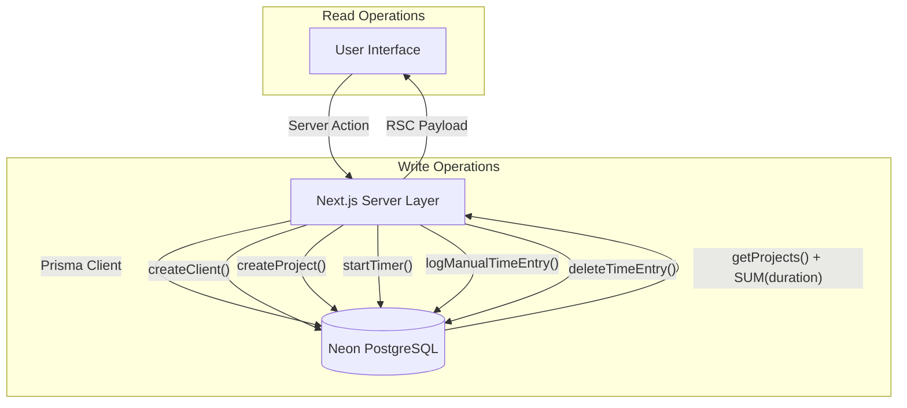
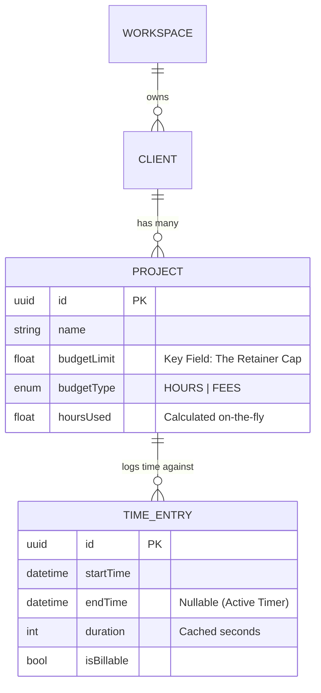

# Retainer-Tracker: Technical Architecture & Developer Guide

**Version:** 2.1.0
**Date:** January 20, 2026
**Status:** Alpha (Core Data & Tracking Implementation Complete)

---

## 1. System Overview

**Retainer-Tracker** is an Enterprise Time & Budget Management application designed for agencies and freelancers operating on a "retainer" model. Unlike standard time trackers, its primary data pivot is the **Budget Limit**.

### 1.1 Core Logic Flow
The system operates on a "Check-Act-Update" loop centered around the Database as the single source of truth.



---

## 2. Technical Architecture

### 2.1 Stack Components

| Layer | Technology | Version | Role |
| :--- | :--- | :--- | :--- |
| **Framework** | **Next.js** | 15.1.0 | Full-stack React framework (App Router). |
| **Language** | **TypeScript** | 5.x | Strict type safety across DB, API, and UI. |
| **Database** | **PostgreSQL** | 16 (Neon) | Serverless relational data storage. |
| **ORM** | **Prisma** | 7.2.0 | Schema definition, migrations, and type-safe query builder. |
| **Styling** | **Tailwind CSS** | 4.0 | Utility-first styling engine. |
| **UI Library** | **Shadcn/UI** | Latest | accessible component primitives (Radix-based). |

### 2.2 Directory Structure (App Router)

The codebase follows a "Colocation" strategy where related logic sits together, split by **Client** (UI) and **Server** (Data).

```text
src/
├── app/                    # Next.js App Router (File-based routing)
│   ├── page.tsx            # Main Server Component (Fetches initial data)
│   └── layout.tsx          # Root Layout (Fonts, Metadata)
│
├── components/
│   ├── ui/                 # Shadcn Primitives (Button, Input, Dialog)
│   └── custom/             # Domain Components (TimerBar, BudgetCard)
│       ├── MainDashboard.tsx  # Client-side State Manager (View switching)
│       └── ...
│
├── server/                 # Backend Logic (Separation of Concerns)
│   ├── actions/            # "Mutations" (Write to DB)
│   │   ├── clients.ts      # createClient
│   │   ├── projects.ts     # createProject
│   │   └── time-entries.ts # startTimer, stopTimer
│   │
│   └── data/               # "Queries" (Read from DB)
│       ├── clients.ts      # getClients
│       ├── projects.ts     # getProjects (includes Aggregations)
│       └── time-entries.ts # getTimeEntries
│
├── lib/
│   ├── prisma.ts           # Global Prisma Client Singleton
│   └── utils.ts            # CN/TwMerge helpers
│
└── types.ts                # Shared Frontend Interfaces
```

---

## 3. Data Architecture (Schema & Models)

The database schema is defined in `prisma/schema.prisma`. It uses a relational model optimized for time aggregation.

### 3.1 Entity Relationship Diagram (ERD)



### 3.2 Key Model Decisions
*   **Duration Calculation:** We store `startTime` and `endTime`. The `duration` field is an integer (seconds) populated *only* when the timer stops. This allows for easier summation queries (`SUM(duration)`) without complex date math in SQL.
*   **Active Timers:** Identified by `endTime: null`. The system enforces a rule that only one entry can have `endTime: null` at a time.
*   **Workspace:** A top-level tenant used to satisfy foreign key constraints. Currently defaults to a system "Default Workspace" but allows for future multi-tenancy.

---

## 4. Feature Implementation Details

### 4.1 The "Global Timer" Logic
The timer is not just client-side state; it persists to the DB immediately.

1.  **Start:**
    *   User enters task & hits Start.
    *   `startTimer()` Server Action is called.
    *   **Atomic Op:** Finds any existing `endTime: null` rows and closes them (sets `endTime = now()`).
    *   Creates new `TimeEntry` with `startTime = now()`.
    *   Calls `revalidatePath('/')` to refresh the UI.

2.  **Running State:**
    *   On page load, `getActiveTimer()` fetches the open entry.
    *   Client `useEffect` calculates `elapsed = now - startTime` every second for display.

3.  **Stop:**
    *   User hits Stop.
    *   `stopTimer(id)` Server Action is called.
    *   Calculates `duration = now - startTime` and saves it to DB.

### 4.2 Manual Time Entry
For post-hoc logging, we use `logManualTimeEntry()`:
*   User supplies `date`, `startTime`, `endTime`.
*   Server constructs `Date` objects and calculates `duration = end - start`.
*   Stores the entry with `isBillable` flag.

### 4.3 Budget Aggregation
We do not store a running total on the Project model (to avoid drift). Instead, we calculate it on read.

**Code Path:** `src/server/data/projects.ts`
```typescript
const projects = await prisma.project.findMany({
  include: {
    timeEntries: true // Fetch all entries
  }
});
// In Mapper:
hoursUsed = entries.reduce((sum, e) => sum + e.duration, 0) / 3600;
```
*Note: For scale (10k+ entries), this will move to a raw SQL `GROUP BY` query.*

### 4.4 Interaction Patterns (React 19)
The app heavily utilizes the `useTransition` hook for all DB mutations.
*   **Why:** Provides a non-blocking way to handle server actions while keeping the UI responsive.
*   **Implementation:** `isPending` states are used to show spinners (`Loader2`) and dim rows during deletion/creation, providing immediate visual feedback to the user.

---

## 5. Development Workflows

### 5.1 Adding a New Feature
1.  **Schema:** Edit `prisma/schema.prisma` -> `npx prisma migrate dev`.
2.  **Backend:** Add `get...` in `src/server/data` and `create...` in `src/server/actions`.
3.  **UI:** Update components in `src/components/custom` to call the new actions.

### 5.2 Deployment
*   **Env Vars:** Requires `DATABASE_URL` (Postgres connection string).
*   **Build:** `npm run build` (Next.js build).
*   **Start:** `npm start`.
*   **Docker:** Can be containerized as a standard Node.js app.

---

## 6. Next Steps & Roadmap
*   **Phase 4: Reports & Analytics:** Implementation of Recharts for visual timeline analysis.
*   **Phase 5: Authentication:** Integrating `Better-Auth` for multi-user support.
*   **Phase 6: Multi-tenancy:** Fully enabling the `Workspace` model for team collaboration.
