# RetainerTracker: Technical Architecture Guide

**Version:** 3.0.0 | **Last Updated:** January 20, 2026

---

## Table of Contents

1. [Executive Summary](#1-executive-summary)
2. [Architecture Overview](#2-architecture-overview)
3. [Technology Stack](#3-technology-stack)
4. [Database Architecture](#4-database-architecture)
5. [Backend Architecture](#5-backend-architecture)
6. [Frontend Architecture](#6-frontend-architecture)
7. [Data Flow & State Management](#7-data-flow--state-management)
8. [Component & Action Reference](#8-component--action-reference)
9. [Developer Operations](#9-developer-operations)
10. [Future Roadmap](#10-future-roadmap)

---

# 1. Executive Summary

## What is RetainerTracker?

RetainerTracker is a **budget-first time tracking** application for agencies and freelancers on retainer billing models. Unlike traditional time trackers that focus on logging hours, RetainerTracker answers: *"How much budget do I have left before I work for free?"*

```mermaid
flowchart LR
    subgraph Traditional["Traditional Time Tracker"]
        A[Track Time] --> B[Log Hours] --> C[Invoice]
        C --> D["😱 Surprise: 15h on 10h retainer"]
    end

    subgraph RT["RetainerTracker"]
        E[Track Time] <--> F[Budget Awareness]
        F <--> G[Real-time Status]
        G --> H["⚠️ Warning at 80%"]
    end
```



## Core Value Proposition

| Problem | Solution |
|---------|----------|
| Budget blindness | Color-coded progress bars (green → amber → red) |
| Scattered tools | Unified timer + budget + reporting |
| Manual calculations | Automatic budget consumption tracking |
| End-of-month surprises | Proactive warnings at 80%/100% thresholds |

---

# 2. Architecture Overview

## System Architecture


## Zero-API Philosophy

RetainerTracker uses **no REST endpoints** for data fetching. Server Components call database functions directly:

```typescript
// Server Component directly queries database
const projects = await getProjects(filters);
return <MainDashboard projects={projects} />;
```

## Directory Structure

```
src/
├── app/                    # Next.js App Router
│   ├── page.tsx           # Server Component (data orchestrator)
│   └── api/               # HTTP endpoints (webhooks only)
├── components/
│   ├── ui/                # Shadcn/UI primitives
│   └── custom/            # Domain components (MainDashboard, TimerBar, etc.)
├── server/
│   ├── actions/           # Mutations (create, update, delete)
│   └── data/              # Queries (read operations)
├── lib/                   # Utilities (Prisma singleton, helpers)
└── types.ts               # Shared UI type definitions
```

---

# 3. Technology Stack

| Layer | Technology | Version | Purpose |
|-------|------------|---------|---------|
| **Framework** | Next.js | 16.1.4 | App Router, Server Components, Server Actions |
| **UI** | React | 19.2.3 | `useOptimistic`, `useTransition` |
| **Language** | TypeScript | 5.x | End-to-end type safety |
| **Database** | PostgreSQL | 16 | Relational storage (Neon serverless) |
| **ORM** | Prisma | 6.19.2 | Type-safe queries, migrations |
| **Validation** | Zod | 4.3.5 | Runtime schema validation |
| **Styling** | Tailwind CSS | 4.0 | Utility-first CSS |
| **Components** | Shadcn/UI | Latest | Accessible primitives (Radix-based) |
| **Charts** | Recharts | 2.15.4 | Data visualization |

### Key React 19 Patterns

```typescript
// Optimistic UI - instant feedback before server confirms
const [optimisticState, setOptimisticState] = useOptimistic(initialState, reducer);

// Non-blocking mutations
const [isPending, startTransition] = useTransition();
startTransition(async () => {
  await serverAction();
});
```

---

# 4. Database Architecture

## Entity Relationship Diagram


## Key Schema Decisions

### 1. Cached Duration Field
```prisma
model TimeEntry {
  duration Int?  // Stored as seconds, NULL if running
}
```
- `SUM(duration)` is O(1) for database
- Allows manual adjustment without changing timestamps
- Calculated when timer stops: `duration = (endTime - startTime) / 1000`

### 2. NULL endTime = Active Timer
```prisma
endTime DateTime?  // NULL means currently running
```
- Simple check: `WHERE endTime IS NULL` finds active timer
- No separate status field needed

### 3. Cascade Behavior
- **Delete Project** → All TimeEntries deleted (Cascade)
- **Delete Client** → Project.clientId set to NULL (SetNull)

### 4. Performance Indexes
```prisma
@@index([projectId])   // Fast project filtering
@@index([startTime])   // Fast date range queries
```

---

# 5. Backend Architecture

## Two-Layer Pattern


| Layer | Location | Purpose | Called From |
|-------|----------|---------|-------------|
| **Data** | `src/server/data/` | Read operations | Server Components |
| **Actions** | `src/server/actions/` | Write operations | Client Components |

## The Atomic Timer Algorithm


**Implementation (`src/server/actions/time-entries.ts`):**

```typescript
export async function startTimer(projectId: string | null, description: string) {
  // 1. Stop any running timers
  const activeEntries = await prisma.timeEntry.findMany({
    where: { endTime: null }
  });

  await Promise.all(activeEntries.map(entry => {
    const duration = Math.floor((Date.now() - entry.startTime.getTime()) / 1000);
    return prisma.timeEntry.update({
      where: { id: entry.id },
      data: { endTime: new Date(), duration }
    });
  }));

  // 2. Create new timer
  await prisma.timeEntry.create({
    data: { projectId, description, startTime: new Date() }
  });

  // 3. Refresh UI
  revalidatePath("/");
}
```

## Optimized Aggregations

```typescript
// BAD: N+1 queries
for (const project of projects) {
  const entries = await prisma.timeEntry.findMany({ where: { projectId: project.id } });
  project.hours = entries.reduce((sum, e) => sum + e.duration, 0);
}

// GOOD: Single aggregation query
const hoursAggregation = await prisma.timeEntry.groupBy({
  by: ['projectId'],
  where: { projectId: { in: projectIds }, endTime: { not: null } },
  _sum: { duration: true },
});
```

---

# 6. Frontend Architecture

## Component Hierarchy


## Server Component: Data Orchestrator

```typescript
// src/app/page.tsx
export default async function Home({ searchParams }) {
  // Parallel data fetching (critical for performance)
  const [projects, clients, entries, metrics] = await Promise.all([
    getProjects(filters),
    getClients(),
    getTimeEntries(),
    getSummaryMetrics(startDate, endDate)
  ]);

  // Map Prisma types to UI types
  return (
    <MainDashboard
      initialProjects={projects.map(mapProject)}
      initialClients={clients.map(mapClient)}
      initialEntries={entries.map(mapEntry)}
      reportData={{ ... }}
    />
  );
}
```

## Budget Status Visualization

```mermaid
flowchart LR
    subgraph Status["Budget Status Colors"]
        Safe["🟢 Safe\n< 80%"]
        Warning["🟡 Warning\n80-100%"]
        Danger["🔴 Danger\n> 100%"]
    end

    Safe --> Warning --> Danger
```



**BudgetCard Color Logic:**

```typescript
const percentage = (hoursUsed / hoursTotal) * 100;

let barColor = 'bg-emerald-500';     // Green: < 80%
if (percentage >= 80) barColor = 'bg-amber-500';   // Amber: 80-100%
if (percentage > 100) barColor = 'bg-rose-600';    // Red: > 100%
```

---

# 7. Data Flow & State Management

## Complete Request Cycle


## State Management Strategies

| State Type | Strategy | Example |
|------------|----------|---------|
| **Server Data** | Props from Server Component | Projects, Entries |
| **URL State** | `useSearchParams` | Filters, Sorting, Pagination |
| **Optimistic** | `useOptimistic` | Timer running state |
| **Local UI** | `useState` | Modal open, current view |

### URL-Based Filtering

```typescript
// Read from URL
const sortBy = searchParams.get('sortBy') || 'updatedAt';

// Update URL (triggers Server Component re-render)
const handleSort = (column) => {
  const params = new URLSearchParams(searchParams);
  params.set('sortBy', column);
  router.replace(`${pathname}?${params.toString()}`);
};
```

**Benefits:** Shareable links, browser history works, no client state sync issues.

---

# 8. Component & Action Reference

## Key Components

| Component | File | Purpose |
|-----------|------|---------|
| **MainDashboard** | `custom/MainDashboard.tsx` | Root client shell, view switching, timer state |
| **TimerBar** | `custom/TimerBar.tsx` | Sticky header with timer controls |
| **BudgetCard** | `custom/BudgetCard.tsx` | Visual budget consumption display |
| **ProjectsList** | `custom/ProjectsList.tsx` | Project CRUD with filtering/sorting |
| **TrackerList** | `custom/TrackerList.tsx` | Time entries grouped by date |
| **ReportsView** | `custom/ReportsView.tsx` | Analytics with Recharts |
| **TimesheetView** | `custom/TimesheetView.tsx` | Weekly grid view |

## Server Actions

### Time Entries (`src/server/actions/time-entries.ts`)

| Action | Parameters | Description |
|--------|------------|-------------|
| `startTimer` | `projectId, description` | Stops active timer, starts new one |
| `stopTimer` | `id` | Sets endTime, calculates duration |
| `logManualTimeEntry` | `{projectId, description, startTime, endTime, isBillable}` | Creates completed entry |
| `updateTimeEntry` | `id, data` | Updates entry, recalculates duration |
| `deleteTimeEntry` | `id` | Removes entry |

### Projects (`src/server/actions/projects.ts`)

| Action | Parameters | Description |
|--------|------------|-------------|
| `createProject` | `FormData` | Creates with name, clientId, budgetLimit |
| `updateProject` | `id, FormData` | Updates project details |
| `deleteProject` | `id` | Deletes project (cascades to entries) |
| `toggleFavorite` | `id` | Stars/unstars project |
| `archiveProject` | `id` | Archives project |

### Clients (`src/server/actions/clients.ts`)

| Action | Parameters | Description |
|--------|------------|-------------|
| `createClient` | `FormData` | Creates with name, currency |

## Validation Pattern

All actions validate with Zod before database operations:

```typescript
const schema = z.object({
  name: z.string().min(1).max(100),
  budgetLimit: z.number().min(0).default(0),
});

export async function createProject(formData: FormData) {
  const parsed = schema.safeParse(rawData);
  if (!parsed.success) {
    return { success: false, error: parsed.error.issues[0]?.message };
  }
  // Use parsed.data only
}
```

---

# 9. Developer Operations

## Quick Start

```bash
# Clone & install
git clone https://github.com/filio623/time_tracker_app.git
cd time_tracker_app && npm install

# Configure
cp .env.example .env
# Edit .env: DATABASE_URL="postgresql://..."

# Database setup
npx prisma migrate dev
npx prisma db seed  # Optional sample data

# Run
npm run dev
```

## Database Commands

```bash
npx prisma studio          # Visual data editor
npx prisma migrate dev     # Create migration
npx prisma generate        # Regenerate client types
npx prisma migrate deploy  # Production migrations
```

## Deployment (Vercel + Neon)

1. Create Neon database at neon.tech
2. Connect GitHub repo to Vercel
3. Add `DATABASE_URL` environment variable
4. Deploy (Vercel auto-detects Next.js)
5. Run `npx prisma migrate deploy`

## Troubleshooting

| Issue | Solution |
|-------|----------|
| "Too many connections" | Verify Prisma singleton in `src/lib/prisma.ts` |
| TypeScript errors after schema change | Run `npx prisma generate` |
| Stale UI after mutation | Ensure `revalidatePath("/")` in server action |

---

# 10. Future Roadmap

| Phase | Feature | Description |
|-------|---------|-------------|
| **5** | Authentication | Better-Auth/NextAuth, user roles |
| **6** | Multi-Tenancy | Workspace switching, invitations |
| **7** | Invoicing | PDF generation, "Mark as Billed" |
| **8** | Tags | Tag UI, filtering, tag-based reports |
| **9** | Desktop App | Tauri wrapper, global hotkeys, menu bar timer |

---

# Appendix: Quick Reference

## File Map

| File | Purpose |
|------|---------|
| `prisma/schema.prisma` | Database schema |
| `src/app/page.tsx` | Server Component orchestrator |
| `src/components/custom/MainDashboard.tsx` | Client shell |
| `src/server/actions/time-entries.ts` | Timer mutations |
| `src/server/data/projects.ts` | Project queries with aggregation |
| `src/lib/prisma.ts` | Database singleton |
| `src/types.ts` | UI type definitions |

## Common Patterns

**Server Action with Validation:**
```typescript
"use server";
export async function createThing(formData: FormData) {
  const parsed = schema.safeParse(data);
  if (!parsed.success) return { success: false, error: parsed.error.issues[0]?.message };
  await prisma.thing.create({ data: parsed.data });
  revalidatePath("/");
  return { success: true };
}
```

**Optimistic Update:**
```typescript
const [state, setState] = useOptimistic(initial, reducer);
startTransition(async () => {
  setState(action);      // Instant UI
  await serverAction();  // Server sync
});
```

**URL State:**
```typescript
const params = new URLSearchParams(searchParams);
params.set('key', value);
router.replace(`${pathname}?${params.toString()}`);
```

---

*End of Technical Guide*
